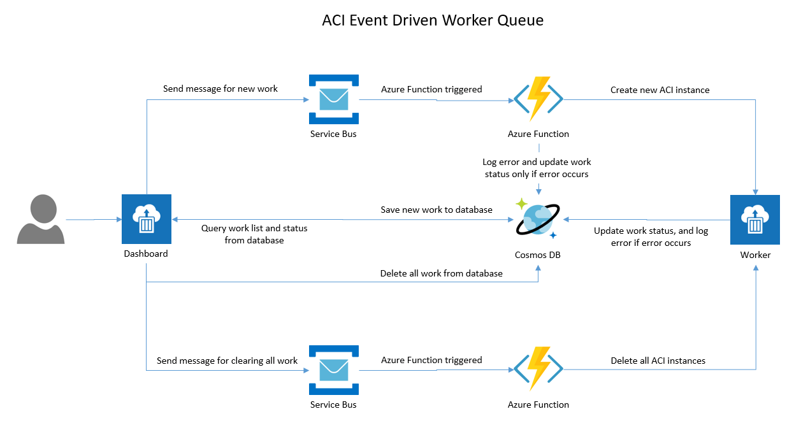

# ACI Event Driven Worker Queue

## Components

1. web-server: This is the host for the dashboard and the api. The dashboard will let you add work to the queue. When work is added a yellow pending container will show up. This is a default place holder until the actual ACI instance comes up and adds it's InProgress state to the DB to be read. Once the container has reached InProgress, the UI will chagne the default pending to Blue with the container's name in place. You can also hit the "More Details" Button to open the model with that containers ID. Currently the modal is calling to the metrics api endpoint for that specific container.

2. go-worker: This is the container to be spawned by the azure function watching the service bus queue. Its takes the enviorment variables: MESSAGE: The message from the queue, CONTAINER_NAME: container group name, DATABASE_URI: CosmosDb mongo connection string. *IMPORTANT:* You must remove the ssl=true url param from the connection string or it will break. When the container is started, it will add a state entry to the DB with its name and InProgress. It then waits a set number of seconds and Adds Done as its state to the DB.

3. Spawner-functions: This consists of two functions. One is watching a queue to create aci instances and another is watching a queue to delete aci instances.



## Deployment Steps

1. Open and login to [Azure Cloud Shell](https://shell.azure.com).

2. Clone the repo.
   ```console
   git clone https://github.com/Azure-Samples/aci-event-driven-worker-queue.git

   cd aci-event-driven-worker-queue
   ```

3. Create resource group.
   ```console
    az group create -l westus -n aci-event-driven
   ```

4. Create a service principal.
   ```console
    az ad sp create-for-rbac -n aci-event-driven --role contributor
    ```
    Output sample:
    ```
    {
      "appId": "fb7c4111-2144-4489-8fd9-XXXXXXXXX",
      "displayName": "aci-event-driven",
      "name": "http://aci-event-driven",
      "password": "0fa91eda-261e-47ad-bb65-XXXXXXXX",
      "tenant": "3dad2b09-9e66-4eb8-9bef-XXXXXXX"
    }
    ```

5. Cd into the `arm` directory and update the `azuredeploy.parameters.json` in the folder `arm` with the service principal credential created above (appId, password, tenant), and assign an unique name for the parameters `functionAppName` and `dnsNameLabel` (for the website).

6. Deploy the Azure resources with the ARM template. This will take a few minutes.
   ```console
    az group deployment create --template-file azuredeploy.json --parameters @azuredeploy.parameters.json -g aci-event-driven
   ```
     Output sample
    ```
    "outputs": {
      "fqdn": {
        "type": "String",
        "value": "web-servertmaalsmhtzqta.westus.azurecontainer.io"
      }
    }
    ```
    > Note: The output `fqdn` is the URL of the ACI dashboard.

7. Download NPM packages.
   ```console
    cd ../spawner-functions

    npm install
    ```
8. Compress the files inside the `spawner-functions` folder as a .zip file.
   ```console
   zip -r spawner-functions-compressed.zip .
   ```

9. Deploy the .zip file to Azure Functions.
   ```console
    az functionapp deployment source config-zip  -g aci-event-driven -n <function-app-name> --src spawner-functions-compressed.zip
   ```
   > Note: The `<function-app-name>` is the `functionAppName` parameter you used for ARM template deployment previously.

## Setup Docker Images (Optional)

Follow the steps below if you want to build your own docker images.

1. Setup `web-server` image
   - Build image.
     ```console
     cd web-server
     docker build -t <dockerid>/web-server:latest .
     ```
   - Push image to Docker Hub.
     ```console
     docker push <dockerid>/web-server:latest
     ```
   - Open the file [azuredeploy.parameters.json](arm/azuredeploy.parameters.json) in `arm` folder, and update the value of the parameter `webServerImage` to point to the new image.
     ```javascript
     "webServerImage": {
         "value": "<dockerid>/web-server"
     }
     ```

1. Setup `go-worker` image
   - Build image
     ```console
     cd ../go-worker
     docker build -t <dockerid>/go-worker:latest .
     ```
   - Upload image to repository
     ```console
     docker push <dockerid>/go-worker:latest
     ```
   - Open the file [index.js](spawner-functions/sbqTriggerCreateWorkerContainer/index.js) in `spawner-functions/sbqTriggerCreateWorkerContainer` folder, and update this line to point to the new image.
     ```javascript
     const IMAGE = "<dockerid>/go-worker:latest";
     ```

## Known Issues

1. During the .zip deployment for the Azure function, the error **Connection aborted** might occur sometimes, to workaround that, you could run the command below, and then re-deploy the Azure function minutes later when the function app is started.
   ```console
   az functionapp restart -g aci-event-driven -n <function-app-name>
   ```
